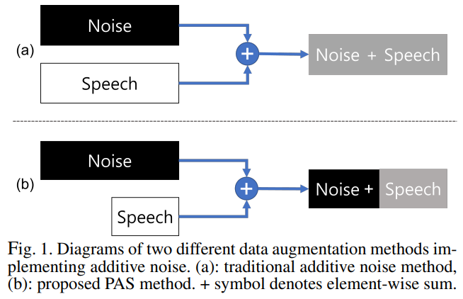
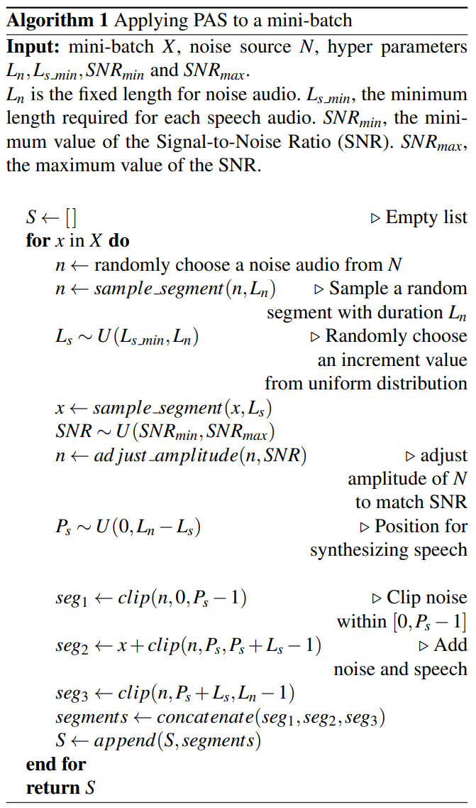

# Partial Additive Speech
This is a pytorch implementation of [Partial Additive Speech data augmentation method](https://arxiv.org/abs/2307.10628).  
  
- __Title__ - PAS: Partial Additive Speech Data Augmentation Method for Noise Robust Speaker Verification
- __Authors__ - Wonbin Kim, Hyun-seo Shin, Ju-ho Kim, Jungwoo Heo, Chan-yeong Lim, Ha-Jin Yu
  
## Abstract
  

Background noise reduces speech intelligibility and quality, making speaker verification (SV) in noisy environments a challenging task. To improve the noise robustness of SV systems, additive noise data augmentation method has been commonly used. In this paper, we propose a new additive noise method, partial additive speech (PAS), which aims to train SV systems to be less affected by noisy environments. The experimental results demonstrate that PAS outperforms traditional additive noise in terms of equal error rates (EER), with relative improvements of 4.64% and 5.01% observed in SE-ResNet34 and ECAPA-TDNN. We also show the effectiveness of proposed method by analyzing attention modules and visualizing speaker embeddings.  
  
## Preprocessing
Before run train and test process, Datasets must be prepared. 
To do that, you need to modify and run `preprocess.py`. 
The modifying just requires set path variables to detect where are VoxCeleb1 dataset and MUSAN noise.  
  
## Run

__1. With docker__  
change paths for mounting in `launch.sh` file and run it.  
- `/data/vox1_musan` - root folder of musan noise
- `/data/voxceleb1` - root folder of VoxCeleb1 data. this folder should have sub directories, `train` and `test`.  
  
__2. Without docker__  
change paths in `config.py` directly and run `main.py`.  
  
## Citation
```
@misc{kim2023pas,
      title={PAS: Partial Additive Speech Data Augmentation Method for Noise Robust Speaker Verification}, 
      author={Wonbin Kim and Hyun-seo Shin and Ju-ho Kim and Jungwoo Heo and Chan-yeong Lim and Ha-Jin Yu},
      year={2023},
      eprint={2307.10628},
      archivePrefix={arXiv},
      primaryClass={eess.AS}
}
```
